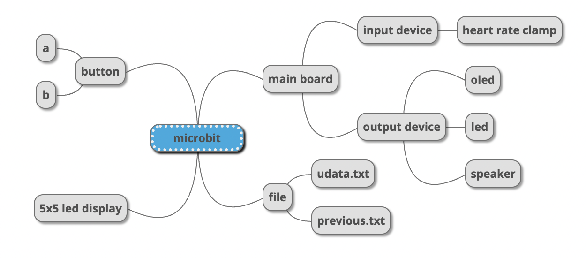
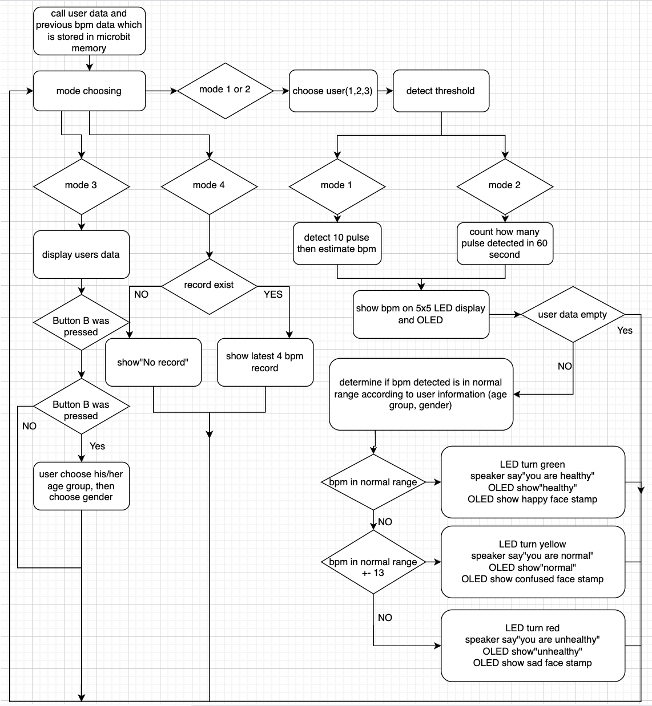

# Microbit-heartbeat-meter
This is a heart-beat meter using Microbit v1 with a heart rate clamp, and a programmed using MicroPython.  
Heart rate clamp connected to a control board which convert clamp's data to analog signal.  
- There are 2 modes: quick scan and full scan
- with a record system inclued
- advice will be given after calculate the heartbeat
- The system component is shown below:  
  
- and the system flow:  

